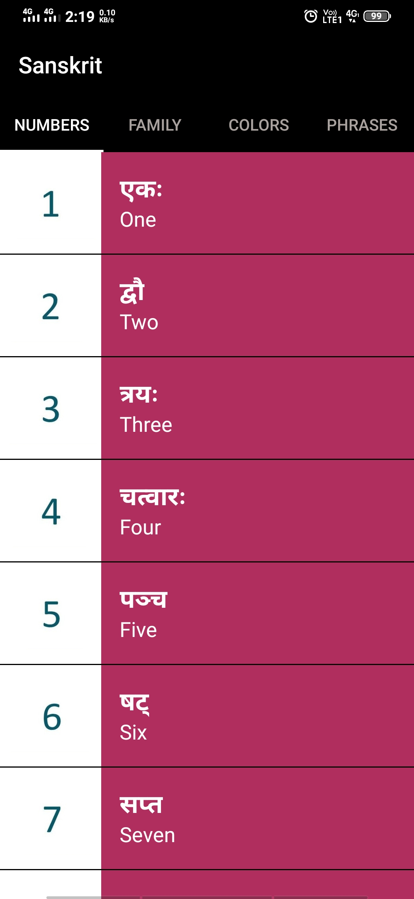
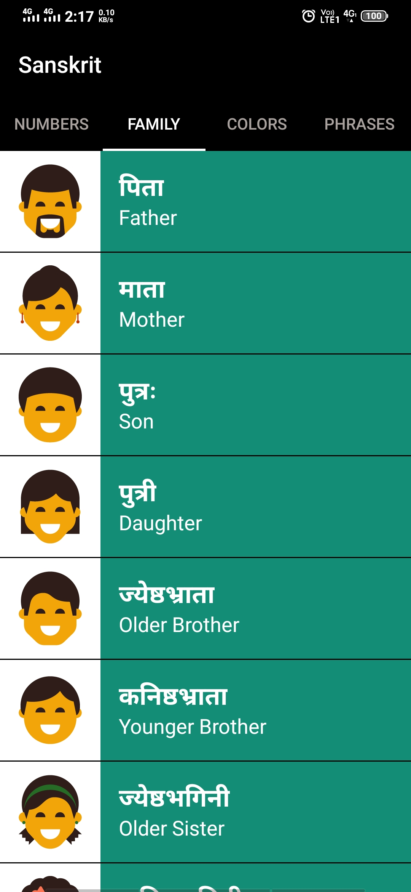
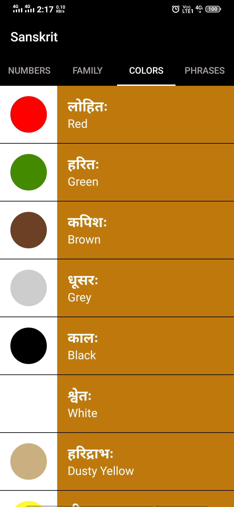
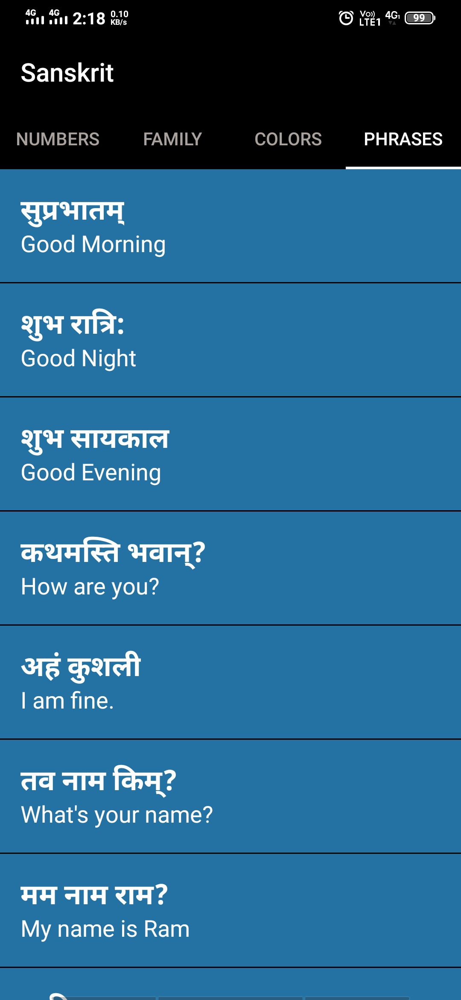
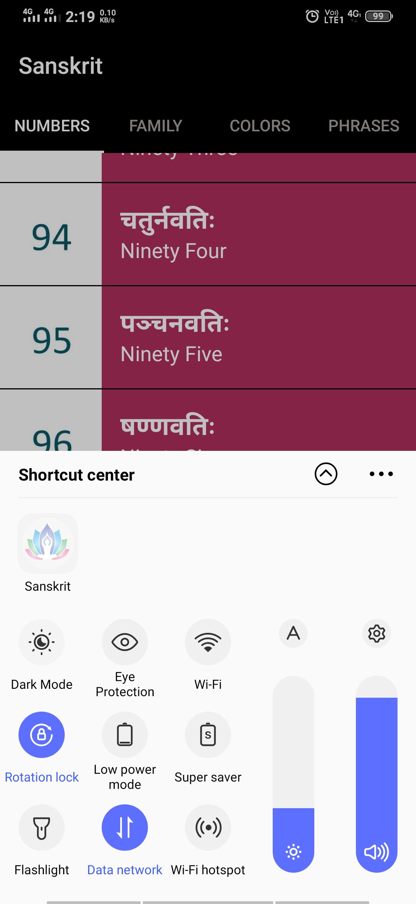

# The Sanskrit App

Do you know? Google Translator or the other famous translators doesn't support Sanskrit language!

Now, Learn the first basic of Sanskrit language with pronunciation and visual image for better understanding.

Tap to play pronunciation (Audio)

To Download the App, [Click Here](/app/release/)

Installation may show some play protect security issues! Which can be ignored.

